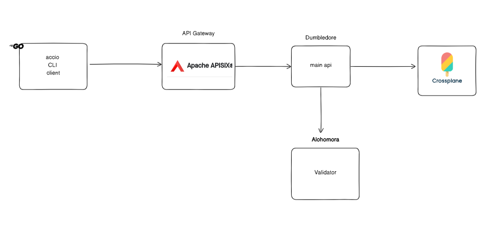

# accio

Create and manage infra accross cloud providers with abstactrations and have them be managed in a gitops fashion.

The name comes from the famous Summoning Charm from the Harry potter movies. Ever needed something desperately at a particular moment, but it was just out of reach? Of course, you have. This enables one to call upon objects from virtually anywhere and have them brought to the caster's current location. 

## Architecture

## How to start

## Roadmap

phase 1: [october]

- Create a simple api which will get request from cli client
- Create simple cli which will interact with the cli
- Add APIsix and then add the authentication logic (keycloak) in it and test using cli
- Generate all the paths needed in the api and add needed commands in the cli
- Understand crossplane and create abstractions for following (start with AWS):
    - VPC
    - DB
    - EC2
    - S3
- Now create workflows so that those abstractions can be created using cli
- Add argocd to the mix and make sure that Gitops is maintained 

phase 2:

- Add another cloud provider to the mix
- Use database to store metadata
- 