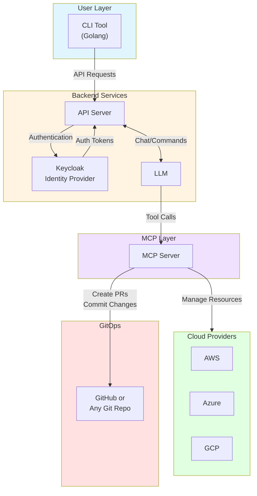

# ACCIO: AI Cloud Platform

Accio is an MCP-based AI Cloud Platform that enables LLMs to manage cloud infrastructure across AWS, Azure, and GCP using a strict GitOps workflow.

## Components

- **accio-cli**: Go-based CLI tool for interaction.
- **accio-api**: FastAPI server for platform logic and auth.
- **accio-mcp**: MCP Server providing tools for the AI.
- **accio-terraform**: Terraform modules and templates.


```mermaid
graph TB
    subgraph User["User Layer"]
        CLI["CLI Tool<br/>(Golang)"]
    end

    subgraph Backend["Backend Services"]
        API["API Server"]
        KC["Keycloak<br/>Identity Provider"]
        LLM["LLM"]
    end

    subgraph MCP["MCP Layer"]
        MCPS["MCP Server"]
    end

    subgraph CloudProviders["Cloud Providers"]
        AWS["AWS"]
        Azure["Azure"]
        GCP["GCP"]
    end

    subgraph GitOps["GitOps"]
        GIT["GitHub or<br/>Any Git Repo"]
    end

    CLI -->|"API Requests"| API
    API -->|"Authentication"| KC
    KC -->|"Auth Tokens"| API
    API <-->|"Chat/Commands"| LLM
    LLM -->|"Tool Calls"| MCPS
    MCPS -->|"Manage Resources"| CloudProviders
    MCPS -->|"Create PRs<br/>Commit Changes"| GIT
    
    style User fill:#e1f5ff
    style Backend fill:#fff4e1
    style MCP fill:#f0e1ff
    style CloudProviders fill:#e1ffe1
    style GitOps fill:#ffe1e1

```

## Quick Start

### Prerequisites
- Docker & Docker Compose
- Go 1.21+ (for CLI)
- Python 3.10+ (for API/MCP)
- Terraform

### Setup

1. **Start Infrastructure**:
   ```bash
   make up
   ```
   This spins up Keycloak, Redis, and Postgres.

2. **Run API Server**:
   ```bash
   cd accio-api
   pip install -r requirements.txt
   uvicorn app.main:app --reload
   ```

3. **Run MCP Server**:
   ```bash
   cd accio-mcp
   pip install -r requirements.txt
   python server.py
   ```

4. **Build CLI**:
   ```bash
   cd accio-cli
   go build -o accio
   ./accio login
   ```

## Documentation

See generic documentation in `docs/`.
