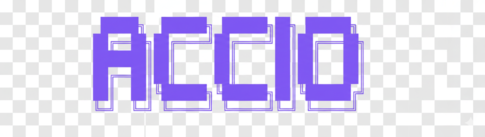

# Accio

> **CLI-first, AI-assisted, GitOps-enabled cloud infrastructure platform.**
> Analyze your code, generate optimal cloud infrastructure, and let GitOps do the rest.

---

## 1. Philosophy & Design Principles

Accio is built around a core set of beliefs about how cloud infrastructure should work for developers:

**Code is the source of truth for what you need. Git is the source of truth for what exists.** You never manually click through a cloud console. You never run `terraform apply` from a laptop. Every infrastructure state change is a commit, every commit is a sync, every sync is reconciled by the platform.

**AI reduces the gap between intent and implementation.** Most developers know what their application does but not what infrastructure it needs. Accio's job is to close that gap — not by guessing, but by analyzing your actual code and reasoning about it with context from its knowledge base.

**The platform should get out of your way after the initial setup.** Once your stack is running, you interact with it through the same CLI — asking questions, checking costs, monitoring health — without needing to know where the resources actually live or how they are wired together.

**Everything is namespaced. Nothing is shared by accident.** Every managed resource Crossplane creates is namespaced within a Kubernetes cluster. Teams cannot accidentally clobber each other's infrastructure.

---
