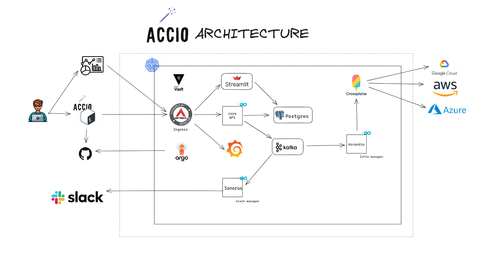

# accio

Create and manage infra accross cloud providers with abstactrations and have them be managed in a gitops fashion.

The name comes from the famous Summoning Charm from the Harry potter movies. Ever needed something desperately at a particular moment, but it was just out of reach? Of course, you have. This enables one to call upon objects from virtually anywhere and have them brought to the caster's current location. 

## Architecture

## Workflow

### Prerequisites

- You will need to create following credentials with appropriate access to them 
    - Cloud provider creds
        - Save them and use them when accio prompts for same
    - Git provider creds
        - Save them and use them when accio prompts for same
        
### Concepts

- Project:
    - This will be a complete git repo which will contain all your stacks. 
    - This should be mapped to each product or a set of products

- Stack:
    - This will be a logical collection of resources
    - The resources can be in any of the 3 cloud providers
    - The patterns in which you can create this is another topic which will be covered in detail in topics below

- Template:
    - These will be stacks with recommended patterns which adhere to best practices
    - You can choose one of these if they fit your usecase
    - Its completely optional.
    - You can also update these templates once you select them

- Resources:
    - These are the smallest unit being managed 
    - This can be a whole kubernetes cluster or a s3 bucket or a small azure key vault secret
    - Resources can be one of:
        - Network
        - Subnet
        - Security
        - RDBMS
        - Nosql db
        - CDN
        - DNS
        - Cloud function

    - This will be created in an opiniated fashion, If you wish to modify the properties to suit your needs, then crossplane related knowledge will be required

### Init

- `accio project init`
    - This will prompt for:
        - Project name
        - Tags to be given
    - note: you can change any of the settings from the config file later
    - This will create a repo in your github 
        - If you dont want to give this right, then alternatively you can create such a repo and provide the name
    
- Once the project is created, we are free to create as many stacks in it
- `accio stack init`
    - This will prompt for:
        - Stack name
        - Tags to be given
        - Cloud providers that will be used
        - You will be prompted for the credentials to be stored in our system
    - note: you can change any of the settings from the config file later
    - This will create a new branch and push it to your remote repo

### Create

- `accio stack create`
    - This will prompt for:
        - What kind of stack you want to create
        - Which cloud provider you want it for
        - Note: There are only some patterns where resources from multiple cloud providers can be used together
    - It will create the required template file, push a commit in the branch and a PR will be raised and ask you to review the template
    - If you want to do any kind of customization, ie any custom fields specific to your requirement or the cloud provider, you can do so during the review
    - Once you approve, the PR will be merged into the main branch and our Gitops pipeline will detect and create the infra in your account

### Update

<TODO>

### Delete

<TODO>

## How to start

## Roadmap

phase 1:

- Create a simple api which will get request from cli client
- Create simple cli which will interact with the cli
- Add APIsix and then add the authentication logic (keycloak) in it and test using cli
- Generate all the paths needed in the api and add needed commands in the cli
- Understand crossplane and create abstractions for following (start with AWS):
    - VPC
    - DB
    - EC2
    - S3
- Now create workflows so that those abstractions can be created using cli
- Add argocd to the mix and make sure that Gitops is maintained 

phase 2:

- Add another cloud provider to the mix
- Use database to store metadata
- 