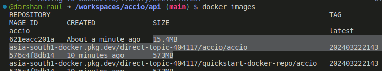

managed to push a image to gcr [gcp artifact repository]

converted a 514mb image to a 15 mb one and it still worked seamlessly

made 2 services and postgres [as a statefulset] run in a local kind cluster

created gke cluster using pulumi and ran nginx on it

